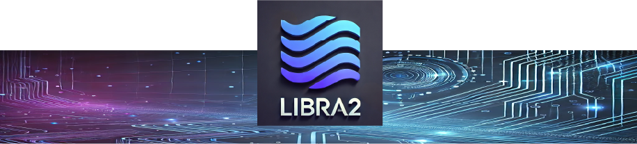

---

Libra2 is an AI driven layer 1 blockchain built to support the future digital asset, crypto market, AI agent & virtual world.

Libra2 inherits Libra, Diem, and Libra2 technologies.

## Getting Started

* [Libra2 Foundation](https://libra2.org/)
* [Libra2 Developer Network](https://docs.libra2.org/)
* [Tutorials](https://https://libra2.org/tutorials)
* Join us on the [Libra2 Discord](https://discord.gg/XXUf99QJ)

## Contributing

You can learn more about contributing to the Libra2 project by reading our [Contribution Guide](https://github.com/libra2org/libra2-core/blob/main/CONTRIBUTING.md) and by viewing our [Code of Conduct](https://github.com/libra2org/libra2-core/blob/main/CODE_OF_CONDUCT.md).

Libra2 Core is licensed under [Apache 2.0](https://github.com/libra2org/libra2-core/blob/main/LICENSE).
